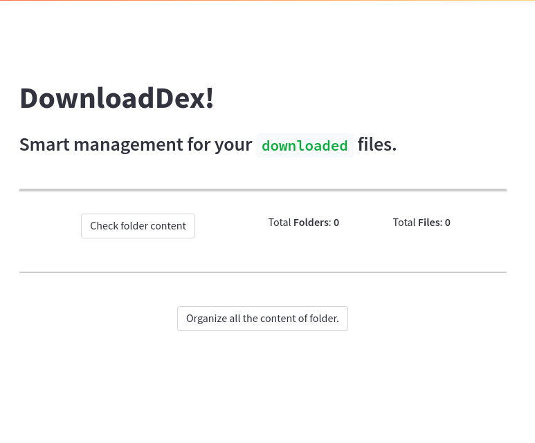

# DownloadDex

`DownloadDex` is an intelligent file and folder management tool that efficiently organizes the contents of
your `Downloads` folder, whether you're using `Windows`, `macOS`, or `Linux`. It automatically categorizes
files into their respective folders, ensuring easy access and a streamlined experience for users.

## To Install the Dependencies:

Install `Python` and then run the command below:
```
pip install -r requirements.txt
```

## To Run:

Run the app using the `streamlit` command:
```
streamlit run main.py
```

## User Interface:




## Contribution and Feedbacks:

I strongly encourage everyone to give this a try, as it significantly helps in organizing content—especially for designers who have numerous files in their `Downloads` folder. Additionally, if you come across anything that appears incorrect or could be improved, feel free to submit a pull request. And if you find this useful, consider giving us a star and showing your support.
